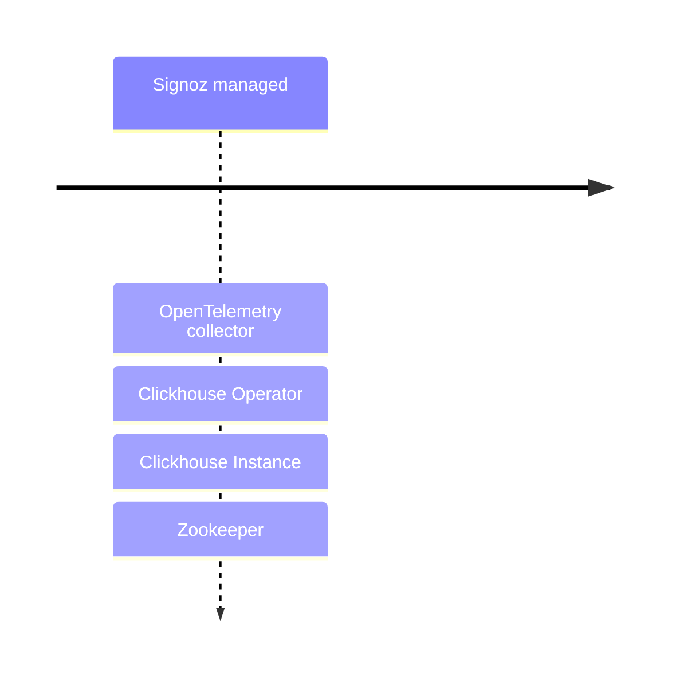

## Telemetry Setup Overview



## 

```sh

mise trust

```

```sh

uv sync

```

Log providers:

[structlog](https://www.structlog.org/en/stable/) - Incompatible with logging via GRPC to OTEL


Resources: 

https://markandruth.co.uk/2025/05/30/getting-opentelemetry-logging-working-in-python
https://github.com/mhausenblas/ref.otel.help/tree/main/how-to/logs-collection


```text
If you are doing logging.basicConfig(level=...) then that level is set on the root logger in your program, and any logs of a lesser level will be dropped. So if you’re saying logging.basicConfig(level=logging.WARNING) then INFO/DEBUG will never be sent to OTEL or anywhere else for that matter, even if you create handlers with their levels as lower than this.
```